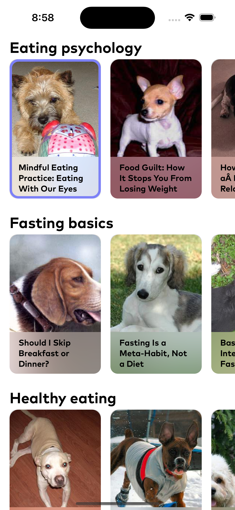

# Тестовое задание для компании IT Factory

## Используемые архитектуры
- UIKit как основной фрейморк для UI
- MVVM как основная архитектура приложения
- URLSession для получения данных с API

## Скрин работы приложения

